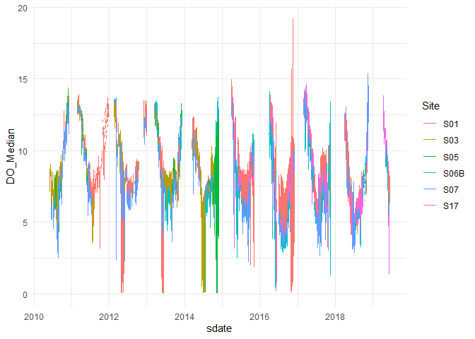
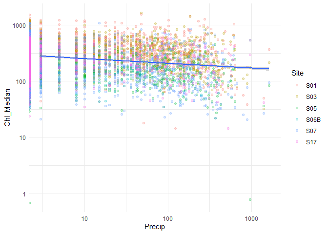

Create Daily Summaries
================
Curtis C. Bohlen, Casco Bay Estuary Partnership
Revised 7/21/2020

  - [Load Libraries](#load-libraries)
  - [Load Sonde Data](#load-sonde-data)
      - [Calculate daily summaries](#calculate-daily-summaries)
      - [Plot to confirm that did what we
        want….](#plot-to-confirm-that-did-what-we-want.)
  - [Load Weather Data](#load-weather-data)
      - [Address trace precipitation](#address-trace-precipitation)
  - [Combine data](#combine-data)
      - [Graphic to check….](#graphic-to-check.)
  - [Export data](#export-data)
  - [Calculate Daily Exceedences](#calculate-daily-exceedences)
      - [Thresholds](#thresholds)
          - [Dissolved oxygen](#dissolved-oxygen)
          - [Chloride](#chloride)
          - [Temperature](#temperature)
      - [Calculate Exceedances](#calculate-exceedances)
  - [Export data](#export-data-1)


# Load Libraries

``` r
library(readr)
library(lubridate)
```

    ## 
    ## Attaching package: 'lubridate'

    ## The following objects are masked from 'package:base':
    ## 
    ##     date, intersect, setdiff, union

``` r
library(tidyverse)
```

    ## -- Attaching packages --------------------------------------- tidyverse 1.3.0 --

    ## v ggplot2 3.3.2     v dplyr   1.0.2
    ## v tibble  3.0.4     v stringr 1.4.0
    ## v tidyr   1.1.2     v forcats 0.5.0
    ## v purrr   0.3.4

    ## -- Conflicts ------------------------------------------ tidyverse_conflicts() --
    ## x lubridate::as.difftime() masks base::as.difftime()
    ## x lubridate::date()        masks base::date()
    ## x dplyr::filter()          masks stats::filter()
    ## x lubridate::intersect()   masks base::intersect()
    ## x dplyr::lag()             masks stats::lag()
    ## x lubridate::setdiff()     masks base::setdiff()
    ## x lubridate::union()       masks base::union()

# Load Sonde Data

``` r
sonde_data <- read_csv("Sonde_Data.csv", 
     col_types = cols(D = col_number(),
                      Press = col_number(), 
                      pH = col_number()),
     progress=FALSE) %>%
  select(-X1)
```

    ## Warning: Missing column names filled in: 'X1' [1]

## Calculate daily summaries

This code generated an inordinate number of warnings, because minimums
and maximums generate warnings whenever they are not well defined
because of missing values. Here, we wrap relevant function calls in
“suppressWarnings()” to minimize that effect.

The problem is not so much with generation of the warnings (which could
be marginally useful), as the effect it has on slowing down execution of
this code. Without suppressing these warnings, the code takes well over
half an hour to run, With warnings suppressed, it only takes a minute or
so.

Note that we downloaded the weather data in metric units, which is the
default in our Python script for accessing NOAA weather data. Note that
some data (like precipitation, snow depth, and temperature) are in
tenths of units.

``` r
daily_data <- sonde_data %>%
  mutate(sdate = as.Date(floor_date(DT, unit='day'))) %>%
  select(-DT, -Press, -Precip) %>%   # These items have a lot of missing values, slowing processing
  group_by(Site, sdate) %>%
  summarize_all(list(Min=~suppressWarnings(min(., na.rm=TRUE)),
                     Max=~suppressWarnings(max(., na.rm=TRUE)),
                     Mean=~mean(., na.rm=TRUE),
                     Median=~median(., na.rm=TRUE),
                     SD=~sd(., na.rm=TRUE),
                     Iqr=~IQR(., na.rm=TRUE),
                     n=~sum(! is.na(.)))) %>%
  mutate(Year = year(sdate)) %>%
  mutate(Month = month(sdate)) %>% ungroup()
```

Many minimums and maximums are replaced with Inf or -Inf, instead of NA.
We need to get rid of all the Inf values.

``` r
daily_data <- daily_data %>%
  mutate(across(where(is.numeric), function(.x) ifelse(is.infinite(.x), NA, .x)))
```

## Plot to confirm that did what we want….

``` r
plt <- daily_data %>% select(Site,sdate, DO_Median, Year) %>%
  ggplot(aes(sdate,DO_Median)) + geom_line(aes(color=Site, group=Year)) +
  theme_minimal()
plt
```

    ## Warning: Removed 43 row(s) containing missing values (geom_path).

<!-- -->

# Load Weather Data

The majority of the data bundled with the Portland Jetport weather data
is not relevant to our needs.

``` r
sibfldnm    <- 'Original_Data'
parent      <- dirname(getwd())
sibling     <- file.path(parent,sibfldnm)

fn <- "Portland_Jetport_2009-2019.csv"
fpath <- file.path(sibling, fn)

weather_data <- read_csv(fpath, 
 col_types = cols(AWNDattr = col_skip(), 
        FMTM = col_skip(), FMTMattr = col_skip(), 
        PGTM = col_skip(), PGTMattr = col_skip(), 
        PRCPattr = col_character(), SNOWattr = col_character(), 
        SNWD = col_skip(), SNWDattr = col_skip(),
        TAVG = col_number(), TAVGattr = col_character(), 
        TMIN = col_number(), TMINattr = col_character(), 
        TMAX = col_number(), TMAXattr = col_character(), 
        WDF2 = col_skip(), WDF2attr = col_skip(),
        WDF5 = col_skip(), WDF5attr = col_skip(), 
        WESD = col_skip(), WESDattr = col_skip(), 
        WSF2 = col_skip(), WSF2attr = col_skip(), 
        WSF5 = col_skip(), WSF5attr = col_skip(), 
        WT01 = col_skip(), WT01attr = col_skip(), 
        WT02 = col_skip(), WT02attr = col_skip(), 
        WT03 = col_skip(), WT03attr = col_skip(),
        WT04 = col_skip(), WT04attr = col_skip(), 
        WT05 = col_skip(), WT05attr = col_skip(), 
        WT06 = col_skip(), WT06attr = col_skip(), 
        WT07 = col_skip(), WT07attr = col_skip(), 
        WT08 = col_skip(), WT08attr = col_skip(), 
        WT09 = col_skip(), WT09attr = col_skip(),
        WT11 = col_skip(), WT11attr = col_skip(), 
        WT13 = col_skip(), WT13attr = col_skip(), 
        WT14 = col_skip(), WT14attr = col_skip(), 
        WT16 = col_skip(), WT16attr = col_skip(), 
        WT17 = col_skip(), WT17attr = col_skip(), 
        WT18 = col_skip(), WT18attr = col_skip(),
        WT19 = col_skip(), WT19attr = col_skip(), 
        WT22 = col_skip(), WT22attr = col_skip(), 
        station = col_skip())) %>%
  #select( ! starts_with('W')) %>%
  rename(sdate = date)
summary(weather_data)
```

    ##      sdate                 AWND             PRCP           PRCPattr        
    ##  Min.   :2010-06-01   Min.   :  4.00   Min.   :   0.00   Length:3499       
    ##  1st Qu.:2012-10-23   1st Qu.: 23.00   1st Qu.:   0.00   Class :character  
    ##  Median :2015-03-17   Median : 31.00   Median :   0.00   Mode  :character  
    ##  Mean   :2015-03-17   Mean   : 33.38   Mean   :  34.12                     
    ##  3rd Qu.:2017-08-08   3rd Qu.: 41.00   3rd Qu.:  15.00                     
    ##  Max.   :2019-12-31   Max.   :116.00   Max.   :1633.00                     
    ##                                                                            
    ##       SNOW         SNOWattr              TMAX          TMAXattr        
    ##  Min.   :  0.0   Length:3499        Min.   :-155.0   Length:3499       
    ##  1st Qu.:  0.0   Class :character   1st Qu.:  56.0   Class :character  
    ##  Median :  0.0   Mode  :character   Median : 144.0   Mode  :character  
    ##  Mean   :  5.3                      Mean   : 140.2                     
    ##  3rd Qu.:  0.0                      3rd Qu.: 228.0                     
    ##  Max.   :564.0                      Max.   : 378.0                     
    ##                                                                        
    ##       TMIN           TMINattr              TAVG           TAVGattr        
    ##  Min.   :-271.00   Length:3499        Min.   :-193.00   Length:3499       
    ##  1st Qu.: -32.00   Class :character   1st Qu.:  16.00   Class :character  
    ##  Median :  44.00   Mode  :character   Median :  98.00   Mode  :character  
    ##  Mean   :  39.31                      Mean   :  90.67                     
    ##  3rd Qu.: 122.00                      3rd Qu.: 179.00                     
    ##  Max.   : 244.00                      Max.   : 290.00                     
    ##                                       NA's   :1034

## Address trace precipitation

Trace rainfall is included in the database by including a measurement
value of zero for precipitation, and including the value “T” as the
first element in PRCPattr.

A total of 140 samples have the minimum value of measured rainfall of `r
m/10` mm. (Reading the metadata, that value corresponds to converting
1/100th of an inch to mm \(0.254mm = 2.54(cm/inch)(10mm/cm) /100\), and
rounding). A higher frequency of observations, 385 of them, were recoded
as having trace amounts of rainfall.

It is not obvious how to incorporate trace rainfall into analyses, or
even whether it is important. Here we create a flag for trace rainfall
and add it to weather\_data. That way, later we can chose to incorporate
it into analyses or not.

``` r
weather_data <- weather_data %>%
  mutate(is_trace = substr(PRCPattr,1,1)=='T')
```

# Combine data

We combine data using “match” because we have data for multiple sites in
daily\_data, and therefore dates are not unique. Match correctly assigns
weather data by date.

``` r
yesterdayprecip <- c(NA, weather_data$PRCP[1 : length(weather_data$PRCP)-1])  # could have used dplyr::lag() here too.

daily_data <- daily_data %>%
  mutate(Precip  = weather_data$PRCP [match(daily_data$sdate, weather_data$sdate)],
         PPrecip = yesterdayprecip   [match(daily_data$sdate, weather_data$sdate)],
         MaxT    = weather_data$TMAX [match(daily_data$sdate, weather_data$sdate)])
rm(yesterdayprecip)
```

## Graphic to check….

``` r
plt <- ggplot(daily_data, aes(x=Precip, y=Chl_Median)) + 
  geom_point(aes(color=Site), alpha=0.25) +
  scale_x_log10() +
  scale_y_log10() +
  geom_smooth(method='lm') +
  theme_minimal()

plt
```

    ## Warning: Transformation introduced infinite values in continuous x-axis
    
    ## Warning: Transformation introduced infinite values in continuous x-axis

    ## `geom_smooth()` using formula 'y ~ x'

    ## Warning: Removed 8201 rows containing non-finite values (stat_smooth).

    ## Warning: Removed 2411 rows containing missing values (geom_point).

<!-- -->
That shows what is almost certainly a significant, but weak correlation.
Salt is diluted by rainfall. Note the clear vertical separation by
sites. Site provides a much clearer signal than does precipitation
alone. We could continue with this graphical analysis, but this calls
out for a hierarchical model.

# Export data

``` r
write_csv(daily_data, 'Daily_Data.csv', na = '')
```

# Calculate Daily Exceedences

## Thresholds

Here we convert daily data to “dates during which”fail" or “Did not
Fail” for each water quality standard or threshold

We have only a few criteria to look at:

### Dissolved oxygen

Maine’s Class B standards call for dissolved oxygen above 7 mg/l, with
percent saturation above 75%. The Class C Standards, which apply to
almost all of Long Creek call for dissolved oxygen above 5 mg/l, with
percent saturation above 6.5 mg/l. In addition, the thirty day average
dissolved oxygen must stay above 6.5 mg/l.

``` r
tClassCDO <- 5      # Units are mg/l or PPM
tClassCPctSat <- 60
tClassBDO <- 7
tClassBPctSat <- 75
```

### Chloride

Maine uses established thresholds for both chronic and acute exposure to
chloride. These are the “CCC and CMC” standards for chloride in
freshwater. (06-096 CMR 584). These terms are defined in a footnote as
follows:

> The Criteria Maximum Concentration (CMC) is an estimate of the highest
> concentration of a material in surface water to which an aquatic
> community can be exposed briefly without resulting in an unacceptable
> effect. The Criterion Continuous Concentration (CCC) is an estimate of
> the highest concentration of a material in surface water to which an
> aquatic community can be exposed indefinitely without resulting in an
> unacceptable effect.

The relevant thresholds are:

``` r
tChlCCC <- 230  # units are mg/l or PPM
tChlCMC <- 860
```

### Temperature

There are no criteria for maximum stream temperature, but we can back
into thresholds based on research on thermal tolerance of brook trout in
streams. A study from Michigan and Wisconsin, showed that trout are
found in streams with daily mean water temperatures as high as 25.3°C,
but only if the period of exceedance of that daily average temperature
is short – only one day. Similarly, the one day daily maximum
temperature above which trout were not found was 27.6°C.

> Wehrly, Kevin E.; Wang, Lizhu; Mitro, Matthew (2007). “Field‐Based
> Estimates of Thermal Tolerance Limits for Trout: Incorporating
> Exposure Time and Temperature Fluctuation.” Transactions of the
> American Fisheries Society 136(2):365-374.

``` r
tMaxT <- 27.6   # Celsius
tAvgT <- 25.3
```

## Calculate Exceedances

The “BOTH” values should turn up TRUE if the day passes both DO and
Percent saturation standards, and FALSE if it fails either.

``` r
exceedance_data <- daily_data %>%
  select(sdate, Site, Year, Month,
         Precip, PPrecip, MaxT, D_Median,
         DO_Min, PctSat_Min, Chl_Max, T_Max, T_Mean) %>%
  mutate(ClassCDO = DO_Min >= tClassCDO, 
         ClassBDO = DO_Min >= tClassBDO,
         ClassC_PctSat = PctSat_Min > tClassCPctSat,
         ClassB_PctSat = PctSat_Min > tClassBPctSat,
         ClassCBoth =  ClassCDO & ClassC_PctSat, # TRUE = passes both
         ClassBBoth =  ClassBDO & ClassB_PctSat, # TRUE = passes both
         ChlCCC = Chl_Max <= tChlCCC,
         ChlCMC = Chl_Max <= tChlCMC,
         MaxT_ex = T_Max <= tMaxT,
         AvgT_ex = T_Mean <= tAvgT) %>%
  select(-DO_Min, -PctSat_Min, -Chl_Max, -T_Max, -T_Mean)
```

# Export data

``` r
write.csv(exceedance_data, 'Exceeds_Data.csv')
```
